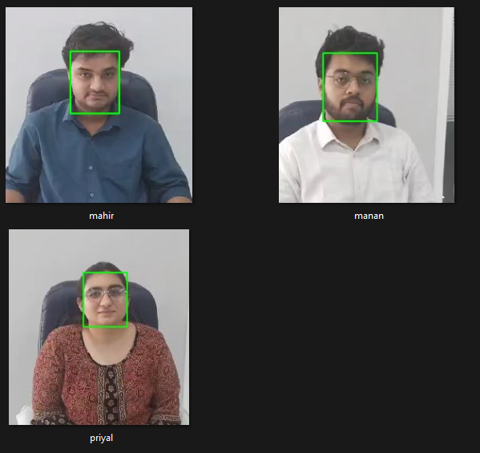
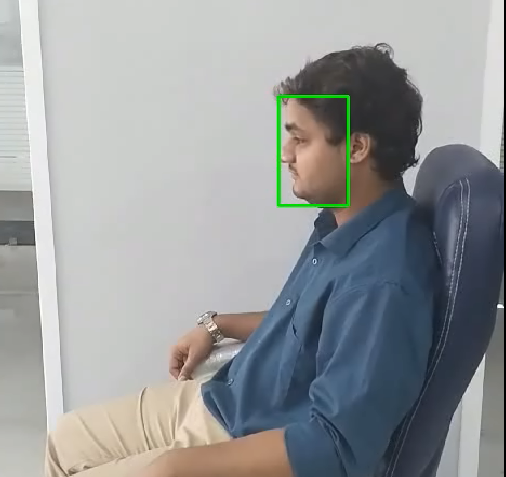
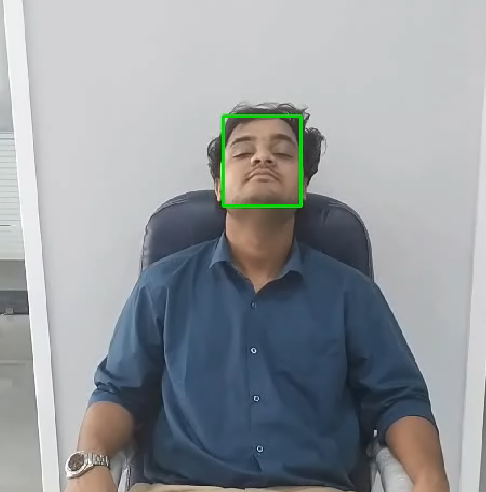
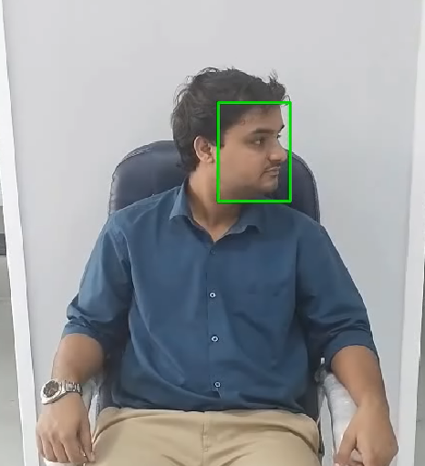
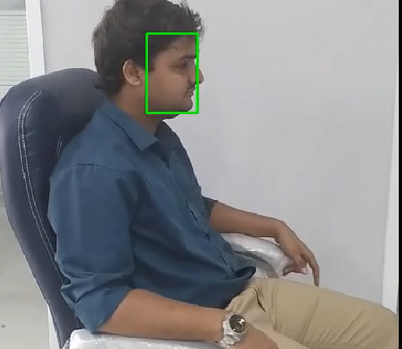
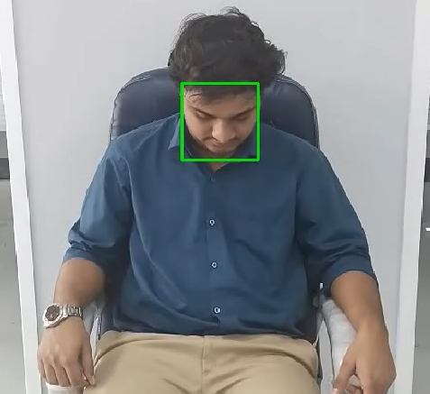

Below is the **README** file for your project, explaining the structure, functionality, and workflow:

---

# Face Recognition System Using Embeddings

This project implements a face recognition pipeline using **MTCNN** for face detection and a **deep learning model InceptionResnetV1 (pretrained = vggface2)** for embedding generation and matching. It processes videos, extracts face embeddings, and performs face recognition using **cosine similarity**.

---

## **Project Structure**

### **Directory Structure**

```
MAHARISHI/
│
├── embedding_pt/                # Stores training face embeddings (.pt files)
│    ├── Mahir.pt
│    ├── Manan.pt
│    └── Priyal.pt
│
├── embeddings/                  # Functions for embedding extraction
│    ├── extract_embeddings.py  # Code for extracting embeddings from video
│    ├── save_embeddings.py     # Code for saving training and test embeddings
│
├── models/                      # Contains the face recognition model
│    └── model.py               # Defines and initializes the deep learning model
│
├── output/                      # Output files (e.g., logs)
│    └── log.txt                # Log file storing recognition results
│
├── recognition/                 # Code for face recognition
│    ├── output_processing.py   # Alerts and output handling
│    └── recognize_faces.py     # Main face recognition logic
│
├── test data/                   # Test video files for face recognition
│    └── Testing_video.mp4
│
├── video data/                  # Training videos for face embedding extraction
│    ├── Mahir.mp4
│    ├── Manan.mp4
│    └── Priyal.mp4
│
├── config.py                    # Configuration for paths and parameters
├── main.py                      # Main script to execute the pipeline
└── test.py                      # Testing and debugging script
```

---

## **Key Files and their Purpose**

### **1. `models/model.py`**

* Initializes and defines the deep learning models:
  * **MTCNN** : For detecting faces in videos.
  * **Embedding Model using InceptionResnetV1** : To generate embeddings for detected faces.

### **2. `embeddings/save_embeddings.py`**

* Saves embeddings for:
  * **Training Data** : Extracts face embeddings from labeled training videos.
  * **Testing Data** : Extracts embeddings from test videos.
* Embeddings are saved as `.pt` files.

### **3. `recognition/recognize_faces.py`**

* Performs face recognition by comparing test embeddings with training embeddings.
* Uses **cosine similarity** to determine the closest match.
* Logs recognition results and alerts for unrecognized faces.

### **4. `recognition/output_processing.py`**

* Processes recognition results to generate alerts for continuous unrecognized faces.

### **5. `config.py`**

* Configures paths to:
  * Training video folder
  * Test video file
  * Training embeddings folder
* Sets the device (CPU/GPU) for computation.

### **6. `main.py`**

* The main execution script for the pipeline:
  1. Initializes models.
  2. Extracts and saves embeddings for training and test videos.
  3. Runs face recognition and logs results.

---

## **Workflow**

### **Step 1: Initialize Models**

The pipeline uses:

* **MTCNN** : For face detection and Box Bounding.
* **Deep Learning Model -** **InceptionResnetV1(pretrained="vggface2")** : To generate embeddings for detected faces.

### **Step 2: Extract and Save Embeddings**

* Training embeddings are extracted from labeled videos in the `video data/` folder.
* Test embeddings are generated from the test video in `test data/`.
* **Output of the detection of the Face:**

  
* | Side View on Video                             | Front View on the Video                        | Side View on Video                                                                                                                                                                                                                                                                                                                                  |
  | ---------------------------------------------- | ---------------------------------------------- | --------------------------------------------------------------------------------------------------------------------------------------------------------------------------------------------------------------------------------------------------------------------------------------------------------------------------------------------------- |
  |  |  |                                                                                                                                                                                                                                                                                                       |
  |  |  | This is the occurence happening<br />while detection of the face inside<br />the blackbox of the **MCTNN and <br />Parse to the InceptionResnetV1** to <br />Gather the Embedding point to <br />detect the Person using Cosine<br />Similarity between the both <br />Embedding of Mahir.pt and Test.pt<br />**Cosine Similarity.** |

### **Step 3: Perform Face Recognition**

* The test embeddings are compared with the training embeddings using cosine similarity.
* Matches are logged with confidence scores in `output/log.txt`.
* **Mathematical Formula**
* Cosine similarity measures the cosine of the angle between two vectors and is calculated as:
* [\text{Cosine Similarity} = \frac {\vec{A} \cdot \vec{B}} / {|\vec{A}||\vec{B}|}]

Where:

* **\(\vec{A}\)**: The test embedding vector (from `test.pt`).
* **(\vec{B})**: The training embedding vector (from `priyal.pt`).
* **(\vec{A} \cdot \vec{B})**: The dot product of the two vectors.
* **(|\vec{A}|)**: The magnitude (length) of vector (\vec{A}).
* **(|\vec{B}|)**: The magnitude (length) of vector (\vec{B}).

**Cosine Similarity Range :**

* **1.0**: The vectors are identical (perfect match).
* **0.0**: The vectors are orthogonal (no similarity).
* **< 0.0**: The vectors point in opposite directions (unlikely in this context).
* **1.0** : The vectors are identical (perfect match).
* **0.0** : The vectors are orthogonal (no similarity).
* **< 0.0** : The vectors point in opposite directions (rare in this context).

### **Step 4: Generate Alerts**

* Alerts are raised if multiple continuous frames contain unrecognized faces, ensuring robust monitoring.

---

## **Usage**

### **Running the Pipeline**

1. Update the paths in `config.py`:
   * `video_data`: Path to the training video folder.
   * `test_data`: Path to the test video.
   * `training_Embedding`: Path to the folder for saving/loading training embeddings.
2. Run the pipeline:
   ```bash
   python main.py
   ```
3. Results are saved in the `output/log.txt` file.

### **Log Format**

The log contains the following:

* **Face Matches** : Detected face names with confidence scores.
* **Alerts** : Continuous unrecognized faces trigger alerts.

---

## **Output Example**

Example **log (`output/log.txt`):**

```
Face 1: Detected Priyal with confidence 0.37
Face 2: Alert - Not in data (best score: 0.30)
Face 3: Detected Mahir with confidence 0.42
Face 4: Detected Priyal with confidence 0.31
Face 5: Detected Mahir with confidence 0.46
Face 6: Detected Priyal with confidence 0.40
Face 7: Detected Mahir with confidence 0.41
Face 8: Detected Priyal with confidence 0.64
Face 9: Detected Priyal with confidence 0.37
Face 10: Detected Priyal with confidence 0.39
------ End of Batch ------
Face 11: Detected Mahir with confidence 0.42
Face 12: Detected Priyal with confidence 0.41
Face 13: Detected Mahir with confidence 0.37
Face 14: Detected Priyal with confidence 0.33
Face 15: Detected Mahir with confidence 0.43
Face 16: Detected Mahir with confidence 0.49
Face 17: Alert - Not in data (best score: 0.25)
Face 18: Detected Mahir with confidence 0.41
Face 19: Detected Priyal with confidence 0.32
Face 20: Detected Mahir with confidence 0.39
------ End of Batch ------
Face 21: Alert - Not in data (best score: 0.18)
Face 22: Detected Mahir with confidence 0.43
Face 23: Alert - Not in data (best score: 0.25)
```

---

## **Requirements**

* Python 3.10 or later
* Libraries:
  * `torch`
  * `opencv-python`
  * `facenet-pytorch`
  * `scikit-learn`

---

## **Future Enhancements**

1. Add more robust face preprocessing (e.g., alignment) using YOLO face model as it is quicker, efficient and faster, especially for the testing data.
2. Improve alert logic for dynamic scenarios with Logic reading and developing better recognition on test data by adjusting environment param.
3. Extend support for multi-threaded video processing for faster embeddings generation.
